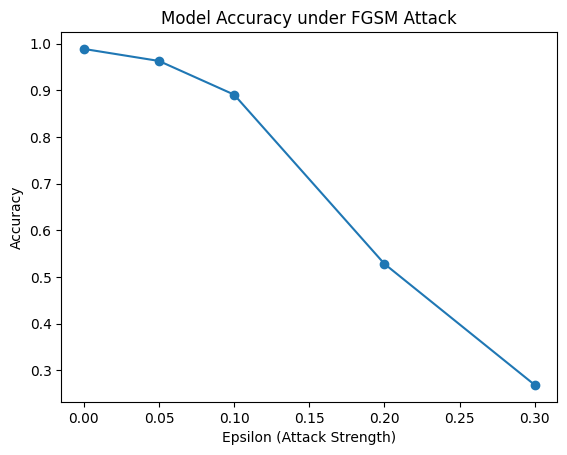
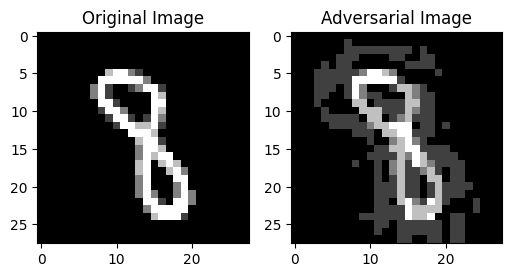

# FGSM Adversarial Attack on MNIST

[](https://colab.research.google.com/github/0xM3d0din/fgsm-adversarial-attack-mnist/blob/main/fgsm_adversarial_attack_mnist.ipynb)

This project reproduces the **Fast Gradient Sign Method (FGSM)** adversarial attack on a convolutional neural network trained on the MNIST dataset.

The experiment is based on the paper:

**Explaining and Harnessing Adversarial Examples**  
Ian Goodfellow, Jonathon Shlens, Christian Szegedy (2015)

---

# Project Overview

Adversarial examples are inputs intentionally modified with small perturbations that cause machine learning models to misclassify them.

This project demonstrates how neural networks can be fooled by adversarial perturbations even when the changes are almost imperceptible to humans.

The goal of this experiment is to analyze how increasing the attack strength affects the robustness of a neural network.

---

# Dataset

The experiment uses the **MNIST handwritten digits dataset**.

Dataset characteristics:

- 70,000 grayscale images  
- 60,000 training samples  
- 10,000 test samples  
- Image size: **28 × 28 pixels**  
- Classes: **digits 0–9**

MNIST is one of the most widely used benchmark datasets in machine learning and computer vision.

---

# Method

The experiment follows these steps:

1. Train a Convolutional Neural Network (CNN) on the MNIST dataset  
2. Generate adversarial examples using the FGSM attack  
3. Evaluate the robustness of the trained model under different perturbation strengths (epsilon values)

FGSM generates adversarial examples using the following equation:

```
x_adv = x + ε * sign(∇x J(θ, x, y))
```

Where:

| Symbol | Meaning |
|------|------|
| x | original input image |
| x_adv | adversarial example |
| ε | perturbation strength |
| J | loss function |
| ∇ | gradient |

---

# Results

The model accuracy under different attack strengths:

| Epsilon | Accuracy |
|--------|--------|
| 0 | 98.9% |
| 0.05 | 96.3% |
| 0.1 | 89.0% |
| 0.2 | 52.8% |
| 0.3 | 26.9% |

The results show that increasing the attack strength significantly reduces model accuracy.

Even small perturbations can dramatically degrade model performance.

---

# Results Visualization

## Model Accuracy under FGSM Attack



This graph shows how the model accuracy decreases as the attack strength (epsilon) increases.

---

## Example of an Adversarial Image



The adversarial image looks almost identical to the original image to humans, but the neural network changes its prediction due to the small perturbation.

---

# Installation

Clone the repository:

```
git clone https://github.com/0xM3d0din/fgsm-adversarial-attack-mnist.git
cd fgsm-adversarial-attack-mnist
```

Install required dependencies:

```
pip install -r requirements.txt
```

---

# Running the Project

You can run the experiment using:

- **Google Colab (recommended)**  
- **Jupyter Notebook**  
- **Local Python environment**

To run in Colab, click the **Open in Colab** button at the top of this README.

---

# Repository Structure

```
fgsm-adversarial-attack-mnist
│
├ fgsm_adversarial_attack_mnist.ipynb
├ requirements.txt
├ README.md
│
└ images
    ├ accuracy_vs_epsilon.png
    └ adversarial_example.png
```

---

# Key Concepts Demonstrated

This project demonstrates several important concepts in adversarial machine learning:

- Neural network vulnerability to adversarial perturbations  
- Gradient-based adversarial attacks  
- Model robustness evaluation  
- Security risks in machine learning systems  

---

# Conclusion

This experiment demonstrates that neural networks are highly vulnerable to adversarial perturbations.

As the attack strength increases, the model accuracy significantly decreases.  
For example, the accuracy drops from **~98% on clean images to ~26% when ε = 0.3**.

Understanding adversarial attacks is essential for developing more robust and secure machine learning systems.

---

## Author

**Mohamed Ali**

Information Security Student & Cybersecurity Researcher

Research interests include AI Security, Adversarial Machine Learning, Digital Forensics, and the security of machine learning systems.  
Actively involved in Red Teaming, Penetration Testing, and Bug Hunting.

Currently preparing for research-based Master's programs in Cybersecurity and AI Security.

GitHub:  
https://github.com/0xM3d0din
